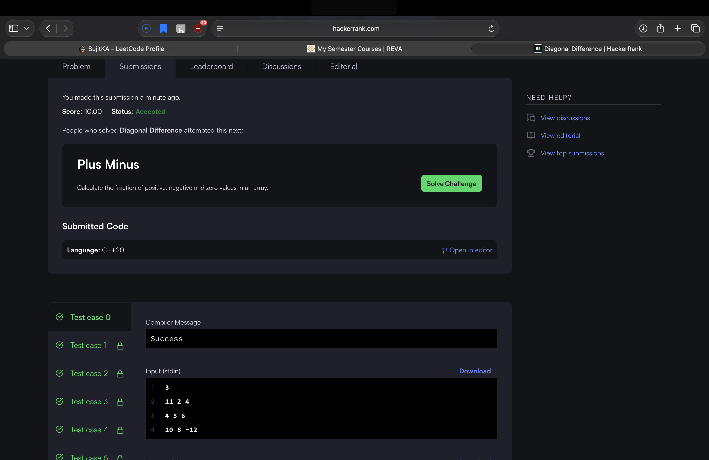
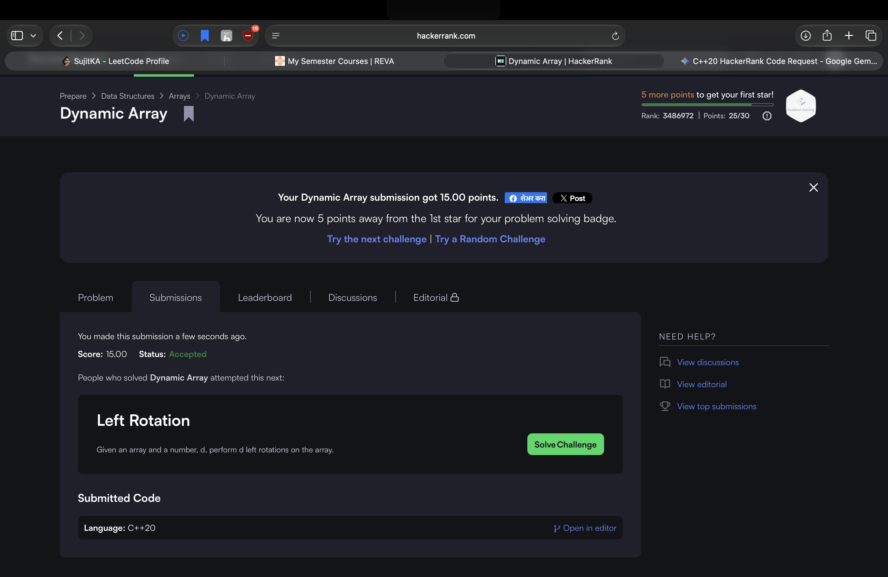
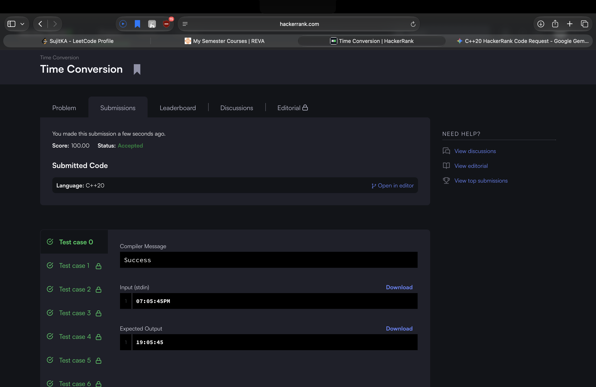
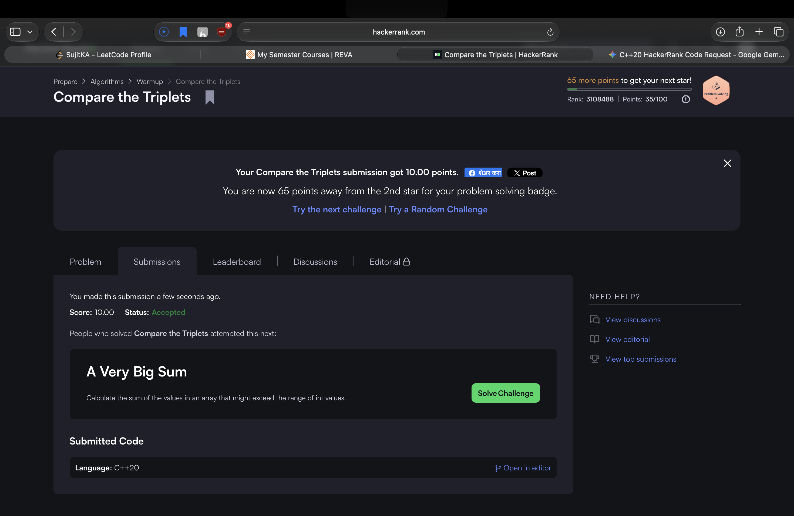
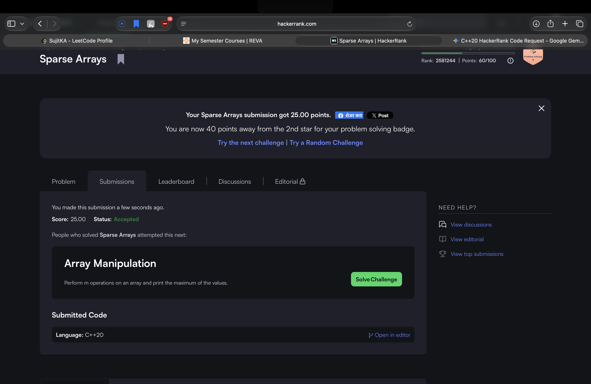

# HackerRank 3rd Semester Portfolio

**Name:** Sujit
**Register No.:** R25EJ154
**Course:** 3rd Semester B.Tech (CSE), Reva University

## Overview
This repository contains my solutions to 5 HackerRank problems completed as part of Activity 8: Algorithmic Problem-Solving & Portfolio Integration. Each problem includes commented source code and a complexity analysis.

## HackerRank Profile
🔗 https://www.hackerrank.com/profile/ssujit0512

## Badge Achieved
🏅 Problem Solving — 3-Star (Silver Level), 235 points

## Problems & Complexity Summary

| # | Problem | Folder | Time Complexity | Space Complexity | Status |
|---|---------|--------|------------------|-------------------|--------|
| 1 | Diagonal Difference | `01-diagonal-difference/` | O(N) | O(1) | ✅ Done |
| 2 | Dynamic Array | `02-dynamic-array/` | O(N + Q) | O(N) | ✅ Done |
| 3 | Time Conversion | `03-time-conversion/` | O(1) | O(1) | ✅ Done |
| 4 | Compare the Triplets | `04-compare-triplets/` | O(1) | O(1) | ✅ Done |
| 5 | Sparse Arrays | `05-sparse-arrays/` | O(N + Q) | O(N) | ✅ Done |

## Submission Screenshots

### Diagonal Difference

### Dynamic Array

### Time Conversion

### Compare the Triplets

### Sparse Arrays

## Tech Stack
- Language: C++20
- Platform: HackerRank